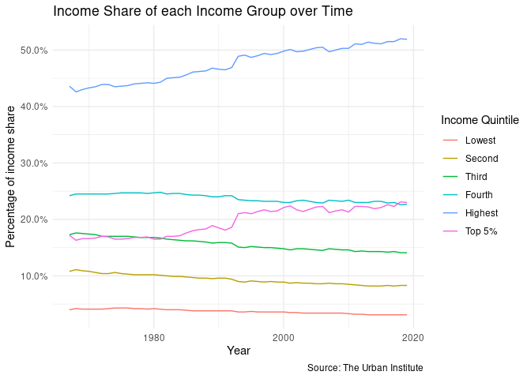
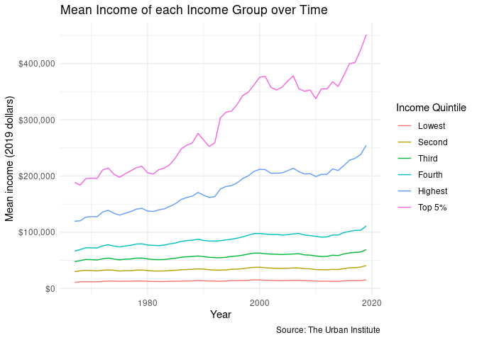
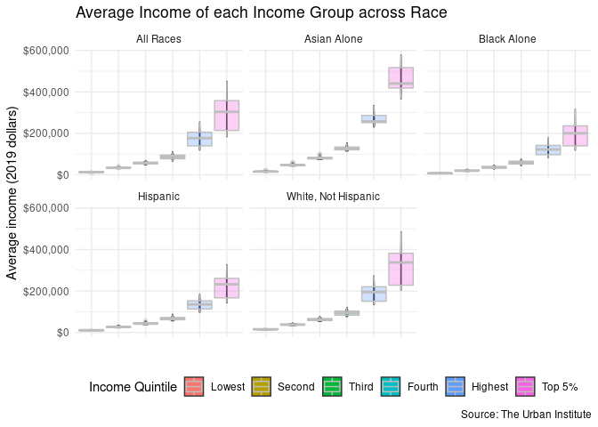
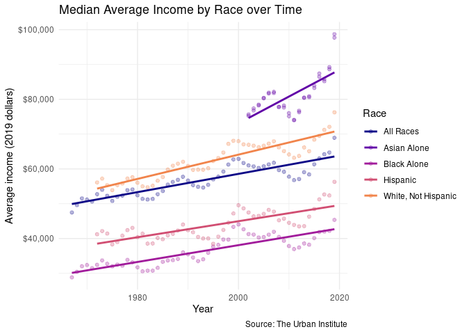
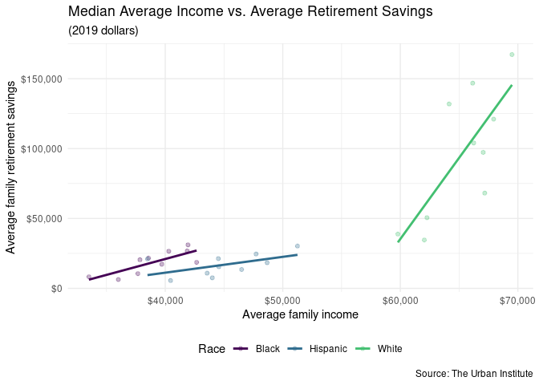
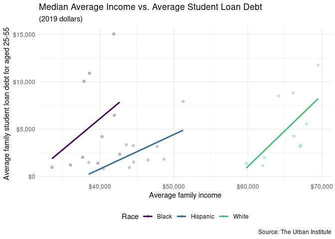
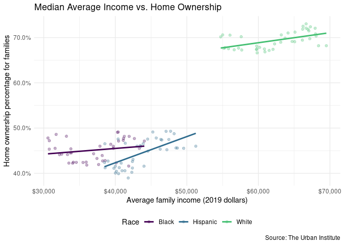
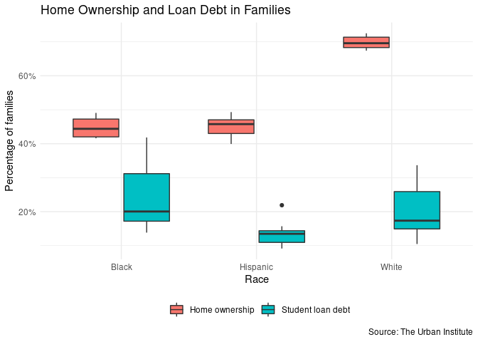
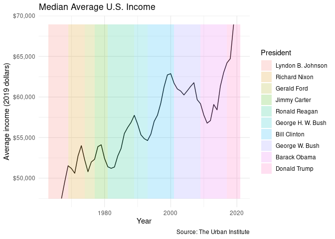

### Load necessary libraries

    library(reprex)
    library(tidyverse)
    library(glue)
    library(knitr)
    library(lubridate)

    theme_set(theme_minimal())

Get the Data
============

I used Tidy Tuesday’s [02/09/2021 challenge
data](https://github.com/rfordatascience/tidytuesday/tree/master/data/2021/2021-02-09).
This particular challenge comes from the Urban Institute and looks at
income inequality. I also am using a dataset of presidents and their
term length [here](https://gist.github.com/namuol/2657233).

\#\#\# **Run [this script](download-hw06.R) to download the data for
this .Rmd.** \# decide if to keep

Simplifying (not tidying) Data
==============================

The income data is already tidy, but I am further simplifying some of it
for easier analysis.

Originally, student\_debt.csv (in column loan\_debt) and retirement.csv
(retirement) are in 2016 dollars, but the income\_mean.csv
(income\_dollars) is in 2019 dollars. For consistency, I’m normalizing
all data to 2019 dollars, using [inflation rate
info](https://www.calculator.net/inflation-calculator.html?cstartingamount1=1&cinyear1=2016&coutyear1=2019&calctype=1&x=83&y=13)
based off average annual CPI data in the U.S. from 1914 to 2020.

I am also simplifying datasets so that possible race values are only
white, non-white Hispanic, Black alone, or Asian alone.

Analyzing the Data
==================

Exploring Broad Income Trends
-----------------------------

Looking at the 1st graph, it’s clear that the highest income quintile
has steadily increased its income share over time (from about 42% in the
mid-1960s to over 50% in 2019) – as has the top 5% of Americans.
Correspondingly, the lower 4 income quintiles have seen their income
share decline, lending credence to the fact that there is widening
income inequality.

The 2nd graph tells a similar story. The bottom 4 income quintiles have
seen little-to-no change in their mean income (with the lowest quintile
looking particularly stagnant), but the highest quintile has increased
from about $125,000 in the mid-1960s to over $250,00 in 2019. The top 5%
has seen even more dramatic change over the past decades, rising from
just under $200,000 in 1967 to nearly $450,000 in 2019.

Exploring Income by Race
------------------------

The 1st graph shows that the aforementioned increase in income for top
quintiles has not been experienced equally by different racial groups.
Asians in the top 5% seem to have a mean income around $425,000, which
is much higher than the typical mean income of $300,000 for all races in
the top 5%. White, non-Hispanic Americans in the top 5% also have
above-typical mean incomes, whereas Black and Hispanic Americans are
notably lower – Black Americans in the top 5% have a mean income less
than half of their Asian counterparts’, about $200,000. The other income
quintiles see a similar pattern: Asians in every quintile tend to have a
mean income higher than the average for all races, whereas Black
Americans have a mean income below that all-race average.

The next graph further confirms this discrepancy. Filtering for the 3rd
income quintile to find the actual median average income of the US, we
see that Black and Hispanic families have lower mean incomes than the
average for all races – and white and Asian families have
higher-than-average mean incomes. It is worth noting that there is a
smaller amount of data available on Asian families, which may partly
influence Asian families’ markedly higher mean incomes. Over time, we do
see a general upward trend in mean income for all races in the 3rd
income quintile – but race seems to play a significant role in
determining mean income.

Other Metrics of Economic Inequality Across Race
------------------------------------------------

<table>
<caption>Averages of Economic Inequality Metrics (2019 dollars)</caption>
<thead>
<tr class="header">
<th style="text-align: left;">Race</th>
<th style="text-align: right;">Mean income</th>
<th style="text-align: right;">Loan debt</th>
<th style="text-align: right;">Retirement savings</th>
</tr>
</thead>
<tbody>
<tr class="odd">
<td style="text-align: left;">Black</td>
<td style="text-align: right;">39010.4</td>
<td style="text-align: right;">5476.63</td>
<td style="text-align: right;">18740.19</td>
</tr>
<tr class="even">
<td style="text-align: left;">Hispanic</td>
<td style="text-align: right;">44972.8</td>
<td style="text-align: right;">2613.73</td>
<td style="text-align: right;">16836.83</td>
</tr>
<tr class="odd">
<td style="text-align: left;">White</td>
<td style="text-align: right;">65233.0</td>
<td style="text-align: right;">5002.01</td>
<td style="text-align: right;">96034.23</td>
</tr>
</tbody>
</table>

As noted above, Black and Hispanic families generally see lower mean
incomes than their white counterparts. This pattern continues for other
income metrics like retirement savings and home ownership. White
families have the highest average mean incomes and retirement savings,
but Black families have the highest average student loan debt. White
families also tend to have higher retirement savings overall and are
much more likely to own their homes (about 70% of white families own
their homes, compared to 45% of Black families), but their average
student loan debt is similar to Black families’. Hispanic families have
notably lower student loan debt, but we caution against hasty
conclusions as there is not much data available for either student loan
debt or retirement savings.

Percentages of Home Ownership & Student Loan Debt
-------------------------------------------------

This boxplot clarifies what we observed: white families have much higher
%s of home ownership, but the % of families with student loan debt is
similar to Black families. Hispanic families have similar home ownership
percentages as Black families, but are less likely to have student loan
debt. For all available races, home ownership percentages seems to be
rather evenly distributed, with no notable skewness. There is much more
skewness and spread in the student loan debt data compared to
homeownership, but this may be mostly due to the small amount of data
available on student loan debt. In general, being white seems to greatly
increase one’s chances of owning a home, but the effect on having
student loan debt is less clear.

Median Average Income & Presidents
----------------------------------

Out of curiosity, we see how the median average income, i.e. the average
income for the third income quintile, has changed over different
presidencies. We can see that median average income dropped during
Carter’s term, likely as part of 1970s stagflation. We also see it
initially decreased during the early years of Obama’s presidency, likely
due to the 2008 financial crisis, but it then returned to 2000 levels
before surpassing it as the economy recovered. This graph doesn’t have
much explanatory power, as presidents have limited effect on the economy
and median average income. Whoever is president doesn’t seem to
determine the mean income a family has like race does, as noted earlier.
It will be interesting to see how median average income changes when the
last year of Donald Trump’s presidency is added, given the economic
downturn brought by the coronavirus.
